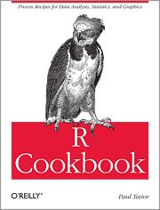
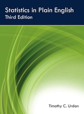
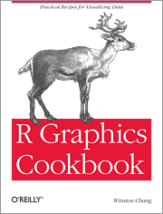
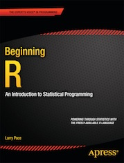
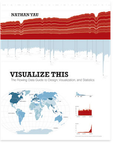

[Introduction to Data Analysis](index.html "Course index")

# Readings

This section documents the list of handbooks and optional readings that you can find in the [course syllabus][syllabus]. We will cover [internal R documentation][012] and [online help][013] in the early stages of the course itself.

[syllabus]: https://github.com/briatte/ida/raw/master/syllabus.pdf
[012]: 012_rstudio.html
[013]: 013_practice.html

## Course handbooks

   

- Robert Kabacoff, *[R in Action](http://www.manning.com/kabacoff/)* (Manning 2011)
- Paul Teetor, *[R Cookbook](http://shop.oreilly.com/product/9780596809164.do)* (O'Reilly 2011)
- Timothy Urdan, *[Statistics in Plain English](http://www.routledge.com/books/details/9780415872911/)* (Routledge 2010)

Handbook chapters are assigned weekly to establish a learning baseline, and independent study of online material is greatly encouraged. All chapters should be read *after* each session to expand on the course material.

## Additional readings

  

- Winston Chang, *[R Graphics Cookbook](http://shop.oreilly.com/product/0636920023135.do)* (O'Reilly 2012)
- Larry Pace, *[Beginning R](http://www.apress.com/9781430245544)* (Apress 2012)
- Nathan Yau, *[Visualize This](http://book.flowingdata.com/)* (Wiley 2011)

Finally, these books go further than what we will explore, but serve as good examples of what you can learn to do with slightly more advanced computing and visualization skills:

- Norman Matloff, *[The Art of R Programming](http://nostarch.com/artofr.htm)* (No Starch Press 2011)
- Edward Tufte, *[The Visual Display of Quantitative Information](http://www.edwardtufte.com/tufte/books_vdqi)* (Graphics Press 2001)
- Hadley Wickham, *[ggplot2. Elegant Graphics for Data Analysis](http://ggplot2.org/book/)* (Springer 2009)

## Tutorials

This course is our best effort to document empirical data analysis with R by example, but you are very welcome to find more relevant resources that better fit your interests. There's tons of R tutorials out there: [here's a good one](https://files.nyu.edu/dm141/public/tutdoc/R_intro/html/Introduction%20to%20R.xhtml), and [here's another good one](http://compdiag.molgen.mpg.de/ngfn/docs/2003/jan/R-intro.pdf).

From our experience, these tutorials will teach you something new every time you read them:

- Winston Chang, [Cookbook for R](http://wiki.stdout.org/rcookbook/) (very good on graphics)
- Robert Kabacoff, [Quick-R](http://www.statmethods.net/) (our favourite reference)
- Chi Yau, [R-Tutor](http://www.r-tutor.com/) (includes basic and more complex techniques)
- UCLA, [Resources to help you learn and use R](http://www.ats.ucla.edu/stat/r/) (stats and more)

You can see from the links above that R is being taught a bit everywhere in the United States and increasingly in Europe. There are a few initiatives in France, including courses at Sciences Po and a few R user groups (RUGs), like the [Fl\tauR](https://fltaur.wordpress.com/) group run by [Ensae](http://www.ensae.fr/) and [Insee](http://www.insee.fr/fr/) users.

If you like video tutorials, we will link to a few of them, and in particular:

- [Anthony Damico](http://www.twotorials.com/) (the "fast and furious" approach)
- [Gordon Davis](https://www.youtube.com/playlist?list=PL8BE0E317807A9A21) (covers data operations well)
- [User Tutorlol](https://www.youtube.com/playlist?list=PL69A9CCD816A5F3A5) (covers a bit of everything)
- [Google Developers](https://www.youtube.com/playlist?list=PLOU2XLYxmsIK9qQfztXeybpHvru-TrqAP) (more programmer-oriented)

The [R video tutorials by Google developers](https://www.youtube.com/playlist?list=PLOU2XLYxmsIK9qQfztXeybpHvru-TrqAP) are also worth a look.

## Blogs

In addition to R tutorials, there are [R blogs](http://www.r-bloggers.com/) and online communities like [Stack Overflow](http://stackoverflow.com/questions/tagged/r) where R users can share questions and answers about the software. Check also a few data and stats communities like [Cross Validated](http://stats.stackexchange.com/questions/tagged/r) or the [/r/datasets][reddit-datasets] channel at Reddit.

[reddit-datasets]: http://www.reddit.com/r/datasets "Reddit datasets"

The visualization component of the course can be explored through [Alberto Cairo's selection of resources](http://www.thefunctionalart.com/2012/10/recommended-readings-for-infographics.html) in that area, which branches with infographics. The most passionate are referred to John P. Boyd's teaching notes on [Scientific Visualization and Information Architecture](http://www-personal.umich.edu/~jpboyd/ENG503.html).

Last, the [SRQM blog](http://srqm.tumblr.com/), created for [another course](http://f.briatte.org/teaching/quanti/) that we teach together with Ivaylo, does its best to deliver a regular amount of illustrated links on statistical analysis for the social sciences as well as on data visualization and other related themes.

> __Next__: [Setup](010_setup.html).
