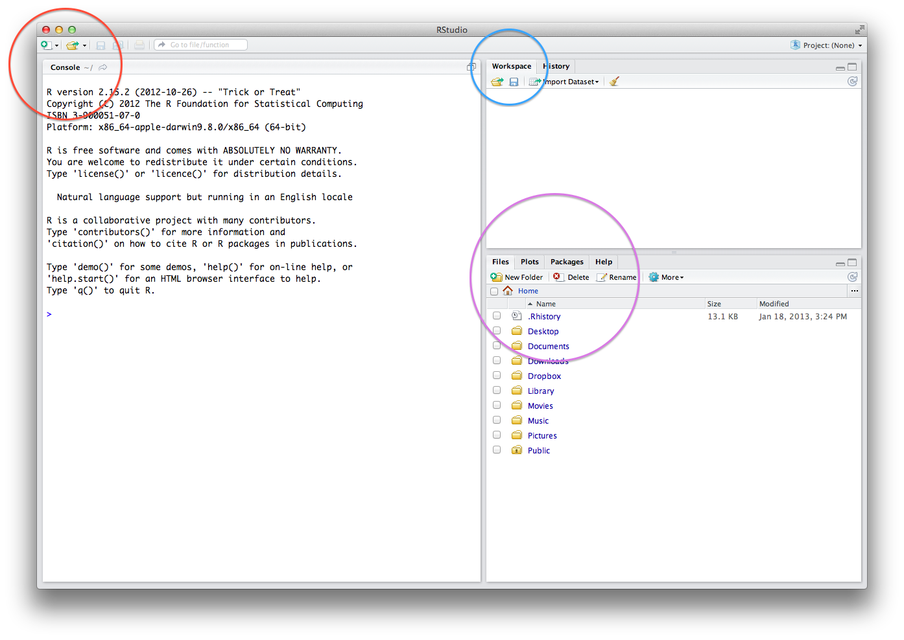
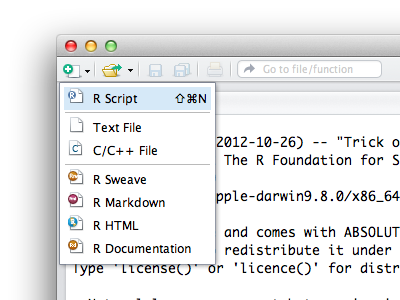
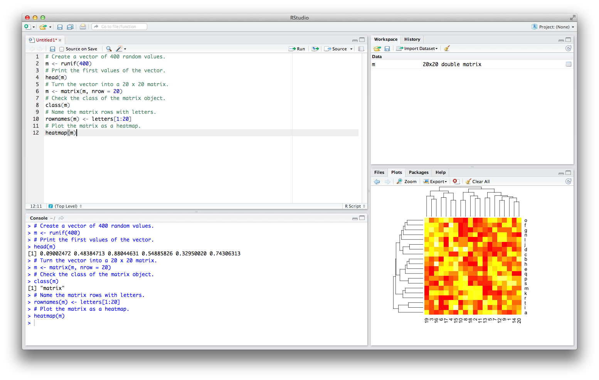
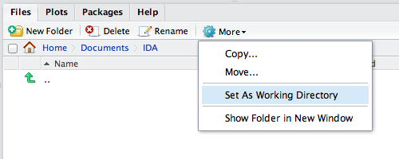
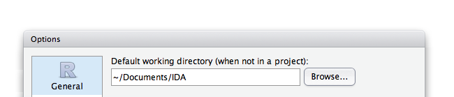
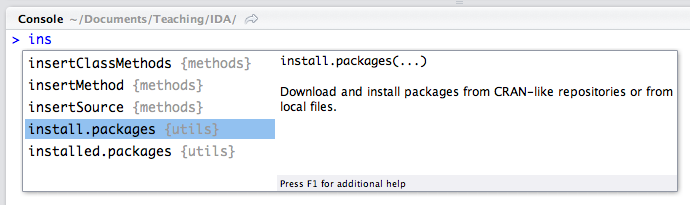
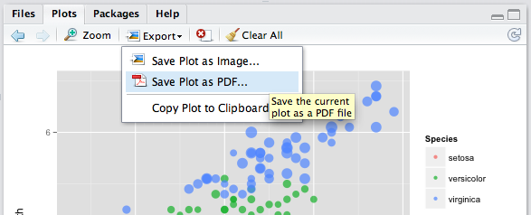

<style>@import url(style.css);</style>
[Introduction to Data Analysis](index.html "Course index")

# 1.2. Installing RStudio

Working with R is easier when you run it through [RStudio](http://rstudio.org/), a software interface that adds many useful features to it. Let's review some basics of both R and RStudio together, run our first R script—and produce our first plot—a random heatmap.

## Installation

Use [this link](http://www.rstudio.com/ide/download/desktop) to download RStudio. Installation should then be pretty straightforward. You will be installing the Desktop version -- the other one is for running RStudio on a server, while you will be running it as a desktop program.

RStudio comes with [excellent documentation](http://www.rstudio.com/ide/docs/) available through the Help menu. The same menu will also show you [keyboard shortcuts](http://www.rstudio.com/ide/docs/using/keyboard_shortcuts), which will quickly come in handy. The sections below cover only the essentials, which should be enough to get you started.

A few more things about the RStudio software:

- __Rstudio requires a 64-bit processor.__ Mac OS X users with older 32-bit processors from circa 2009 will have to use an old version that is not available from the website any more—just ask us for it if you are using an old MacBook model.
- __RStudio is frequently improved__—it was actually updated on the day we started the class! You can choose to update it periodically, or you can stick with the version of RStudio that you installed: it should not have any impact on the course.
- __RStudio can crash from time to time.__ It might sometimes have to "abort your R session", which means crashing R without crashing RStudio itself. Please let us know when that happens. You will generally be able to quickly restart a new R session.
- __RStudio is very quickly developing__ into a powerhouse for R, with [more features](http://www.rstudio.com/ide/) than we will be able to show. One of the most recent developments allows to [build web applications](http://www.rstudio.com/shiny/) on top of R code, directly from RStudio.

## Interface

When you open RStudio for the first time, you see something like the screenshot below, composed of three quadrants. Each quadrant is called a "pane" of the RStudio window interface:

[](images/rstudio-interface-1.png)

The red circle designates the Console window, where you get to type commands and see their results. The blue circle designates the Workspace, where your objects appear. The purple circle designates a bunch of other windows for files, plots, packages and help.

## Running scripts

Most of the time, you will have one more pane open on the top-left side of the screen to view, edit and run R scripts. Press &#8984;-&#8679;-N (Mac) or Ctrl-&#8679;-N (Win) to open a new R script. You can also use the File menu to select "New > R Script", or use this icon:



After opening the new R script, copy-paste the entire code snippet below into it:

```{r matrix-heatmap, eval=FALSE}
# Create a vector of 400 random values.
m <- runif(400)
# Print the first values of the vector.
head(m)
# Turn the vector into a 20 x 20 matrix. 
m <- matrix(m, nrow = 20)
# Check the class of the matrix object.
class(m)
# Name the matrix rows with letters.
rownames(m) <- letters[1:20]
# Plot the matrix as a heatmap.
heatmap(m)
```

Finally, select the whole code and run it. You will see results get printed out (in black) in the Console, along with the code (in blue). The `m` object will also appear in the Workspace, and a random heatmap will appear in the bottom-right pane:

[](images/rstudio-interface-2.png)

## Setting the working directory

Let's now save the script. Click the "Files" tab in the bottom-right pane. Choose the folder where you store your student stuff, and create a new folder called `IDA` for this course. Then set it as the working directory through the More menu, as shown below:



The working directory is the default location on your computer where R looks for stuff. RStudio copied that location to the Console when you completed the step described above, as if you had run the `setwd` command, which sets the working directory to a given folder:

```{r setwd, eval=FALSE}
setwd("~/Documents/Teaching/IDA")
```

You can now save your script: focus on it by clicking anywhere in its window, press &#8984;-S (Mac) or Ctrl-S (Win), and RStudio will offer to save it in your `IDA` folder. Save it there under a sensible name like `heatmap-demo.R`. R scripts should end with the `.R` extension.

Finally, set your course folder as the default working directory in RStudio's preferences. Open the preferences with &#8984;-, (Mac) or from "Tools > Options". The very first preference is the default working directory, which should be set to your `IDA` folder:



The folder path, or location, printed above is one on my own (Mac OS X) system. Your computer will show a different one. RStudio also shows that path on top of the Console window. Tip: always opt for simple folder paths.

Last but not least: __never move your `IDA` folder once you have set it up__, or RStudio will not be able to find it. This will cause useless trouble, like running into cascades of errors because your scripts cannot find the course datasets.

## Tab auto-completion

Now that the script is saved, take a minute to explore its code by navigating its lines with the keyboard arrow keys. Switch back and forth from the Source Editor (the script) to the Console (its results) by pressing Ctrl-1 and Ctrl-2 to change the cursor focus.

Your goal for the first month of class is actually to get as much practice with keyboard navigation and shortcuts as you can, so that you get used to running code from a script file while tinkering it from the Console.

A nifty feature of RStudio (and R) in that regard is tab auto-completion. Type in the first letters of a command and press `Tab`: possible command names will appear. The example below shows how to reach the `install.packages()` command through tab auto-completion:



To get the auto-completion window to open, just type in a few letters like `ins` and then (gently) hit the `Tab` key. The auto-completion feature also shows you the basic command description and syntax, which you can also get in the documentation pages.

## Packages

R is extremely modular: it comes with a set of "base" commands that can be supplemented with user-contributed commands, often installed through the [CRAN](http://cran.r-project.org/) online central repository from which you previously downloaded R itself.

This is a core feature of R, as its open source nature has encouraged the development of thousands of user-contributed commands. Let's first take a look at which packages come with R by default, and where the packages are installed:

```{r default-packages}
# See the default packages.
getOption("defaultPackages")
# See where packages are stored.
.libPaths()
```

Remember that R is case sensitive: the commands above require that the `O` in `getOption` and `P` in `libPaths` are typed in uppercase. Also note the unusual starting dot at the beginning of the `.libPaths()` function.

Let's install a few packages straight away. To do that quickly, your best option is simply to copy-paste the code below into a new R script, and to run it as you previously did with the random heatmap example.

```{r install-packages, tidy=FALSE}
# Create a list of essential packages.
list <- c("foreach", "knitr", "devtools", "ggplot2", "downloader", "reshape")
# Select those that are not installed.
list <- list[!list %in% installed.packages()[, 1]]
# Install the missing packages.
if(length(list))
  lapply(list, install.packages, repos = "http://cran.us.r-project.org")
```

Note that the last two lines should be run together to work as intended. The result will be a lot of red ink: R is going to diagnose which of these packages you do not yet have installed, and then install them. You need to be online for this to work.

Once installed, the additional packages can be loaded (initialized) with the `library()` or `require()` commands. Each package brings its own functionalities: `ggplot2` package is used for [plotting neat graphics](http://ggplot2.org/), `downloader` is used to download data from online sources, etc.

```{r load-packages, results='hide'}
# Load ggplot2 package.
library(ggplot2)
# Load downloader package.
library(downloader)
```

The "loading ..." messages that you might get by running the commands above are not errors but simply a sign that other packages are loaded at the same time in the background. R prints errors, messages and warnings (non-fatal errors) in the same color, which is indeed confusing.

This is one of R's idiosyncracies: you cannot trust the colors. Red ink does always not stand for "problem", just like no result can mean that everything went alright, which is a rather behaviour in programming environments.

## Drawing and saving plots

One last functionality that we want to show as part of the RStudio interface has to do with plots. Let's take inspiration from a [quick introduction to `ggplot2`](http://blog.echen.me/2012/01/17/quick-introduction-to-ggplot2/), a graphics package that you should have [previously](11_r.html) installed when trying out package installation in R.

```{r ggplot2-load-package}
# In case you have not yet installed ggplot2, this will.
if(!require(ggplot2)) {
  # Install the ggplot2 package.
  install.packages("ggplot2")
  # Load the ggplot2 package.
  library(ggplot2)  
}
```

We'll be looking at some example data included in the R software. The data describes a set of fifty flowers studied by famous statistician Ronald Fisher in an article published in 1936. The data itself were collected by Edgar Anderson and published a year before.

```{r ggplot2-load-data}
# Look at first rows of a default dataset.
head(iris)
```

Let's now use the 'quick plot' functionality of the `ggplot2` package. The command `qplot` requires three arguments here: the data to use, one variable to plot on the horizontal x-axis, and another to plot on the vertical y-axis.

```{r ggplot2-qplot}
# Quick plot.
qplot(data = iris, x = Sepal.Length, y = Petal.Length)
```

We will come back to how `ggplot2` works in due time; for the moment, let's simply improve the plot by adding a bunch of options that will add some color, sizing and transparency effects to the plot that opened in the bottom-right pane.

```{r ggplot2-3, tidy=FALSE}
# Select all lines below to run properly.
qplot(data = iris, 
      x = Sepal.Length, 
      y = Petal.Length, 
      color = Species, 
      size = Petal.Width, 
      alpha = I(0.7))
```

This plot can be saved to PNG (a [bitmap](https://en.wikipedia.org/wiki/Raster_graphics) format) or PDF (a [vector](https://en.wikipedia.org/wiki/Vector_graphics) format) from the Export menu. You will want to use PNG if you are saving the plot for screen viewing, e.g. posting on a Web page. Otherwise, you will prefer to export the plot as PDF, as shown below.



RStudio will open a window to ask you for a few details, such as the filename for the exported graphic. The default saving location will be your working directory. After the plot is exported, it will open in your default PDF viewer, so that you can check everything went well.

## Help pages

Type in `help.start()` to access the index of documentation pages in R. The documentation is only that helpful, so looking for help online is frequent practice. Finding help is a skill in itself, and there's an etiquette to [asking questions online](https://www.youtube.com/watch?v=ZFaWxxzouCY).

If you do not understand a specific command, then type its name with a question mark in front of it, as in `?c`. If that does not work, or if you are looking for keyword, type two question marks in front of it, as in `??heatmap`, to perform a fuzzy search.

Help pages open in the bottom-right pane of RStudio. Try these examples out:

```{r help-commands, eval=FALSE, tidy=FALSE}
# Command help.
?setwd
# Keyword search.
??heatmap
```

There is also a command to bring up the help pages of an entire package:

```{r help-packages, eval=FALSE}
help(package="downloader")
```

Note, finally, that typing the name of a function without its brackets will also show some form of help, which is generally useful only if you know a bit more about low-level programming in R. Here's a simple example showing how the `median()` function works internally:

```{r help-function}
median
```

R documentation pages contain precise instructions on the syntax of each command: read the "Description", "Usage" and "Arguments" sections first, then skmi the (not always useful) "Details". Always check out the "Examples" section.

Do not hate the documentation: _everyone_ finds it difficult to read, and there are good reasons why the technical documentation is written how it is. It is not really meant to teach you R but rather to document it like a flight manual documents a plane: fully and exactly.

> __Next__: [Practice](013_practice.html).
