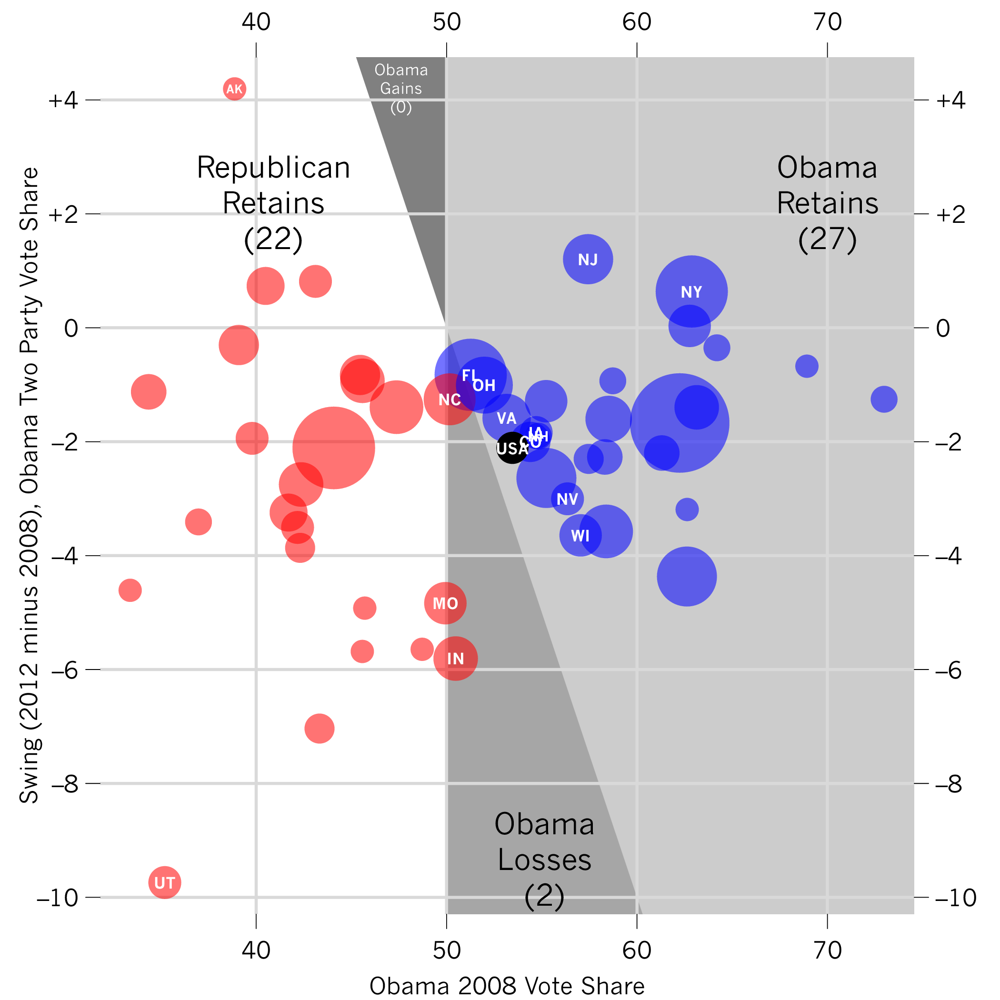

# Introduction

This is a course on data analysis. We think that you will like this course if you enjoy facts, graphics and being able to make things by yourself.

## How we got there

(Skip to where it says "tl;dr" if you are already bored.)

We had four different ideas before we launched the course in its current form.

__The first idea__ was that this optional course should pick you up where your first-semester mathematics and economics courses left you. Since both courses brushed upon linear models as part of their programme on empirical methods, we thought: "Let's write an introductory stats course that builds around linear models, with some background and extensions."

(Linear models are a class of statistical techniques usually referred to as "linear regression".)

__The second idea__ was that this course should be a practice module, a workshop if you like, where you would learn to actually compute some of the stuff that you saw in slides and handbooks during your first term. Since the course is new, we thought: "Let's write an introductory stats course using a free, open source product that students can keep using their whole lives."

At that stage, we decided to write the course with R, the software that we will talk about more in later sections.

__The third idea__ derived from the complexity of R, which is less a "stats software" than a *statistical computing* software. You can reach pretty deep into programming with R, and this shows up in the way that you need to operate it to make things happen. Since this could also appeal to some, we thought: "Let's write an introductory stat computing course."

(Statistical computing means using your computer to analyze data. [Here's what it looks like](http://www.stat.cmu.edu/~cshalizi/statcomp/) for people your age who study statistics.)

__The fourth idea__ came from the quick realisation that we were riding several horses at once: statistics, computing, visualization and social science. So we thought: "Let's write a (whatever) course with R, and give it a name later on." That name ended up being "data analysis".

You'll see that the course still tastes a bit like all of the ideas above: there's a bit of math, lots of stats, tons of computing, and, we hope, even more graphs. But fundamentally, we want to make it a course about data analysis, and have you learn a set of skills in this area.

__tl;dr:__ ... So, what is data analysis? Here's Jeff Leek's take on it.

We'll pursue the following teaching goals:

1. __The primary aim of the course__ is to provide you with some skills to understand how statistical computing can contribute to the visualization and analysis of real-world data.
2. __The secondary aim of the course__ is to show you how a healthy dose of programming can help taking into account large amounts of evidence about the economy, politics and society.

## Who is this for

The course will explain how visualization feeds into current trends in data journalism, open government and reproducible science.

To get a taste of it, see [this selection of dataviz methods](http://selection.datavisualization.ch/), read some articles from [Robert Kosara's blog](http://eagereyes.org/) on computational graphics, and read [Drew Conway's article](http://www.drewconway.com/zia/?p=2378) on how old and new skills collide over data visualization.

You will find the course challenging because you will learn some statistical and visual syntax to produce plots out of data.

You will end up telling us what *you* actually like and dislike about this course because it will run as a teaching experiment.

__Below is an example__ that shows the U.S. presidential election result as a function of state-level voting characteristics. To produce such a graph on your own, you would need to get some data, select which dimensions to analyze, and finally plot the results. This course will introduce you to all three procedures, which refer to different skills.

## Outline

The breakup goes roughly as follows:

1. The course starts with the basics (Sessions 1--4). We'll cover R syntax, objects and data operators, plus a bit of math.
2. The course continues with a bunch of statistical methods (Sessions 5--8). We'll cover clusters, distributions, hypothesis tests and linear models.
3. The course ends on slightly more advanced visualization techniques (Sessions 9--12). We'll cover time series, networks, maps, and conclude on data science.

The list of topics is tentative at best.

## Requirements

__To follow and complete this course__, you will need a laptop with Internet access and an interest in building both computer and statistical skills. Please bring your laptop at every class and make sure that you know how to use it to work (e.g. how to manage files and folders, install an application, unzip files, fast-switch between windows, etc.).

__The course requires that you focus on learning by trial-and-error__ instead of focusing on getting it "right" immediately: take this course to work on your skills at problem-solving. In order to complete the course, you will also have to search for documentation, examples and tutorials from various sources: prepare to [Google responsibly](http://agbeat.com/real-estate-technology-new-media/google-cheat-sheet-every-trick-you-need-to-master-search/)!

__Grades are not a crucial element of the course__: you will be assessed mainly through your level of engagement with the coursework, which will consist in forming a small-scale student data team to publish short projects. The precise content of the projects will be decided in class, following each team's research interests.

__Feedback is a crucial element of the course__: you will be assessed in part through the level of feedback (either positive or negative) that you provide on an assigned session. You will be required to tell us whether you find the method exposed in the session useful, what applications you can imagine for it, and whether we managed to make you understand how it works (and if not, why).

__Graphics are a crucial element of the course__: [bad graphics](http://andrewgelman.com/2011/09/worst-graph-of-the-year/) have dire consequences on how we learn about events, so we will focus a lot of our attention to the construction and examination of graphics. Data visualization will be complemented with essential statistical analysis along the way.

## It's a teaching experiment

This course is a teaching experiment: we really, *really* need your feedback to make it work. Specifically, we'd like you to tell us what you want to do with the skills that we will teach you, so that we can help you get there.

We'll suggest exercises like drawing plots to illustrate your student newspaper, or building small-scale datasets out of student networks. But we are very open to all suggestions: tell us what you want to achieve, and we'll do our best to make it happen if it's reasonable.

We hope to present the results of this course in [other](http://r2013-lyon.sciencesconf.org/) [venues](http://ecprnet.eu/Events/PanelList.aspx?EventID=5&SectionID=52), in order to report how well (or how badly) the experiment ran.

Next: [Readings](02_readings.html)