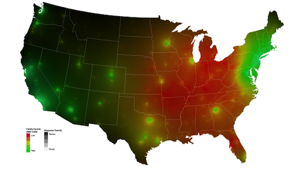

<style>@import url(style.css);</style>
[Introduction to Data Analysis](index.html "Course index")

# 10.2. Choropleth maps

The code in this section ends on examples of choropleth maps of Barack Obama's vote shares in the 2008 and 2012 U.S. presidential elections. The operations covered before the final result include the usual data import routines as well as a few replication plots. Contrarily to our [first map][100], we do not code a plot function as to leave the full ggplot2 syntax apparent.

[100]: 100_maps.html

```{r packages, message=FALSE}
packages <- c("downloader", "ggplot2", "maps", "RColorBrewer", "scales", "XML")
packages <- lapply(packages, FUN = function(x) {
  if(!require(x, character.only = TRUE)) {
    install.packages(x)
    library(x, character.only = TRUE)
  }
})
```

## Two-party vote shares in the United States

This example is based on an [example map][ds] by David Sparks. It shows how to map U.S. state-level electoral data [collected by David Wasserman][dw]. The next code block will start by downloading the data and importing a selection of rows and columns from the CSV file. The only noteworthy step is that we remove the District of Columbia to un-skew later distributions.

[ds]: http://is-r.tumblr.com/post/35200999886/make-your-own-electoral-map
[dw]: https://docs.google.com/spreadsheet/ccc?key=0AjYj9mXElO_QdHpla01oWE1jOFZRbnhJZkZpVFNKeVE#gid=0

```{r dw-grab}
# David Wasserman's data.
link = "https://docs.google.com/spreadsheet/pub?key=0AjYj9mXElO_QdHpla01oWE1jOFZRbnhJZkZpVFNKeVE&gid=0&output=csv"
# Download the spreadsheet.
if(!file.exists(file <- "data/wasserman.votes.0812.txt")) download(link, file, mode = "wb")
# Import selected rows.
dw <- read.csv(file, stringsAsFactors = FALSE, skip = 4)[-c(1:6, 19:20, 28), -c(4, 7:8)]
# Check result.
str(dw)
```

The next clode block cleans the dataset by removing punctuation and other text symbols from the variable names and values. It then adds a logical marker to discriminate the first twelve states in the data, which are treated as swing ("battleground") states in the plots. The list of 'swing states' used id slightly different from the one used by [Simon Jackman][sj].

```{r dw-clean}
# Fix dots in names.
names(dw) <- gsub("\\.\\.", "", names(dw))
# Remove characters.
dw <- data.frame(gsub("\\*|,|%", "", as.matrix(dw)), stringsAsFactors = FALSE)
# Make data numeric.
dw[, -1] <- data.matrix(dw[, -1])
# Create marker for swing states.
dw$Swing <- FALSE
# Mark first twelve states.
dw$Swing[1:12] <- TRUE
# Check result.
dw[1:15, ]
```

We imported the data without the precalculated two-party vote shares (VS), in order to run the formulas on our end. The first variable codes a state "blue" or "red" based on party victory. The last variable measures the size of the swing that would have been required for a given state to change hands (for Romney to win).

```{r dw-margins}
# Obama victory margins, using two-party vote.
dw  <- within(dw, {
  State_Color <- ifelse(Obama08 > McCain08, "Blue", "Red")
  # Margin in 2008.
  Total_VS_08 <- Obama08 + McCain08
  Obama_VS_08 <- 100 * Obama08 / Total_VS_08
  # Margin in 2012.
  Total_VS_12 <- Obama12 + Romney12
  Obama_VS_12 <- 100 * Obama12 / Total_VS_12
  # Obama swing in two-party vote share.
  Obama_Swing <- Obama_VS_12 - Obama_VS_08
  # Swing required for state to change hands.
  Rep_Wins <- 100 * (Romney12 - Obama12) / Total_VS_12
})
# Check results.
str(dw)
```

We now plot a first overview of the data, based on [Simon Jackman's analysis][sj] of similar figures. The list of swing states and the actual swings are slightly different in his visualization, and only one $x$-axis is scaled in our rendering because ggplot2 enforces the Stephen Few recommendation [against dual scales][sf].

[sj]: http://jackman.stanford.edu/blog/?p=2620
[sf]: http://www.perceptualedge.com/articles/visual_business_intelligence/dual-scaled_axes.pdf

```{r dw-dotplot, fig.width = 9, fig.height = 12, tidy = FALSE}
# Order plot by states.
dw$State <- with(dw, reorder(State, Obama_Swing), ordered = TRUE)
# Dot plot.
ggplot(dw, aes(y = State, x = Obama_Swing)) +
  geom_vline(x = c(0, mean(dw$Obama_Swing)), size = 4, color = "grey95") +
  geom_point(aes(colour = ifelse(Obama08 > McCain08, "Dem", "Rep")), size = 5) +
  geom_point(data = subset(dw, Swing), aes(x = Rep_Wins), size = 5, shape = 1) +
  scale_x_continuous(breaks = -10:4) +
  scale_colour_manual("2008", values = brewer.pal(3, "Set1")[c(2, 1)]) +
  labs(y = NULL, x = NULL, title = "Obama Swing in Two Party Vote Share\n")
```

In the plot above, the first grey line is the average swing in vote share in 2012, and the second one marks the zero-swing point. The black points are the theoretical swing points at which the battleground states would have gone Republican. Read [Simon Jackman][sj]'s analysis for more on the topic.

Let's also replicate Simon Jackman's second plot, showing the swing from 2008 to 2012 against Obama's vote share in 2008 weighted by electoral college votes. The first step for this plot is to get the number of electoral college voters per state as well as state abbreviations, both from Wikipedia. The data are merged to the principal data frame.

```{r dw-more-data, cache = TRUE}
# Electoral college votes, 2012.
url = "http://en.wikipedia.org/wiki/Electoral_College_(United_States)"
# Extract fifth table.
college <- readHTMLTable(url, which = 5, stringsAsFactors = FALSE)
# Keep first and last columns, removing total electors.
college <- data.frame(State = college[, 1], 
                      College = as.numeric(college[, 35]))
# Merge to main dataset.
dw <- merge(dw, college, by = "State")
# U.S. states codes.
url = "http://en.wikipedia.org/wiki/List_of_U.S._states"
# Extract fifth table.
uscodes <- readHTMLTable(url, which = 2, stringsAsFactors = FALSE)
# Keep first and last columns, removing total electors.
uscodes <- data.frame(State = uscodes[, 1],
                      Abbreviation = uscodes[, 4])
# Merge to main dataset.
dw <- merge(dw, uscodes, by = "State")
# Check result.
str(dw)
```

The final plot follows. It confirms that Obama won by protecting the battleground states, losing only two states in the overall swing. Also, if you have not started Nate Silver's blog yet, now might be the time, starting with [swing voters versus elastic states][ns-elastic].

[ns-elastic]: http://fivethirtyeight.blogs.nytimes.com/2012/05/21/swing-voters-and-elastic-states/

```{r dw-jackman-auto, warning = FALSE, fig.width = 12, fig.height = 12}
# Swing vs. Vote Share, weighted by Electoral College Votes.
ggplot(dw, aes(y = Obama_Swing, x = Obama_VS_08)) +
  geom_rect(xmin = 50, xmax = Inf, ymin = -Inf, ymax = Inf,
            alpha = .3, fill = "grey95") +
  geom_point(aes(color = Romney12 > Obama12, size = College), alpha = .6) +
  geom_text(colour = "white", 
            label = ifelse(dw$Swing, as.character(dw$Abbreviation), NA)) +
  scale_colour_manual("2008", values = brewer.pal(3, "Set1")[c(2, 1)]) +
  scale_size_area(max_size = 42) +
  labs(y = "Obama Swing in Two Party Vote Share", x = "Obama 2008 Vote Share") +
  theme(legend.position = "none")
```

## Mapping the electoral swing

To map the swing from 2008 to 2012, we load U.S. geographical data and extract its state names. The method corresponds to the code provided by [David Sparks][ds]: it takes a `map` object provided in the `maps` package and adds the variables of interest to it, using the `region` variable as the unique identifier for U.S. states.

```{r dw-map-adjust}
# Load state shapefile from maps.
states.data <- map("state", plot = FALSE, fill = TRUE)
# Convert shapes to a data frame.
states.data <- fortify(states.data)
# Extract states from data frame.
states.list <- sort(unique(states.data$region))
# Exclude Washington D.C. (sorry).
states.list = states.list[-which(grepl("columbia", states.list))]
# Subset to map states (sorry Alaska).
dw = subset(dw, tolower(State) %in% states.list)
# Transpose data to map dataset.
states.data$SwingBO <- by(dw$Obama_Swing, states.list, mean)[states.data$region]
states.data$Obama08 <- by(dw$Obama_VS_08, states.list, mean)[states.data$region]
states.data$Obama12 <- by(dw$Obama_VS_12, states.list, mean)[states.data$region]
```

The plot is going to show quintiles of the Obama swing from 2008 to 2012. To make the code shorter, the quintiles are calculated by a short function, and the plots use a common `ggplot2` structure. Most of the graph options are set to make the plot blank. The coordinates of the plot are made conic to curve the map correctly.

```{r dw-map-choropleth-auto, fig.width = 12, fig.height = 6.6, tidy = FALSE}
# Choropleth map function.
ggchoro <- function(x, q = 5, title = NULL) {
  x = states.data[, x]
  states.data$q = cut(x, breaks = quantile(round(x), 
                                           probs = 0:q/q, 
                                           na.rm = TRUE),
                      include.lowest = TRUE)
  ggplot(states.data, 
         aes(x = long, 
             y = lat, 
             group = group, 
             fill = q)) +
    geom_polygon(colour = "white") + 
    coord_map(project = "conic", lat0 = 30) +
    scale_fill_brewer("", palette = "RdYlBu") +
    labs(y = NULL, x = NULL, title = title) +
    theme(panel.border = element_rect(color = "white"), 
          axis.text = element_blank(),
          axis.ticks = element_blank()) 
}
# Choropleth maps.
ggchoro("SwingBO", title = "Swing in the Obama vote share")
ggchoro("Obama08", title = "Obama vote share, 2008")
ggchoro("Obama12", title = "Obama vote share, 2012")
```

David Sparks has also posted code for [simpler maps][ds-simplemaps] with less data wrangling, and [chloropleth maps][ds-choropleth] with more precise data. In the future, there's a chance that he will also post his code for [isarithmic map][ds-isarithmic] that look like this:

[][ds-isarithmic]

[ds-simplemaps]: http://is-r.tumblr.com/post/37708137014/us-state-maps-using-map-data "U.S. state maps using map data (David Sparks)"
[ds-choropleth]: https://dsparks.wordpress.com/2011/02/21/choropleth-tutorial-and-regression-coefficient-plots/ "Choropleth tutorial and regression coefficient plots (David Sparks)"
[ds-isarithmic]: https://dsparks.wordpress.com/2012/07/18/mapping-public-opinion-a-tutorial/ "Mapping public opinion: A tutorial (David Sparks)"

> __Next week__: [Networks](110_networks.html).
