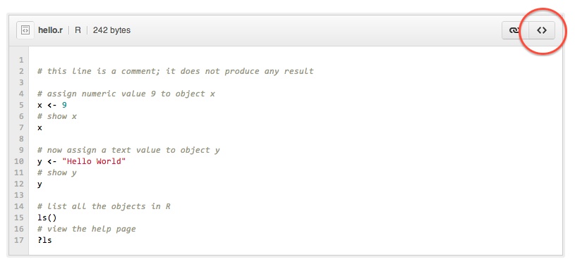

<style>@import url(style.css);</style>
<small>[Introduction to Data Analysis](index.html)</small>

# 1.1. Installing R

[R](http://www.r-project.org/) is a software that uses a specific language to manipulate statistical objects. Researchers and statisticians are [increasingly](http://r4stats.com/articles/popularity/) adopting R as their software of choice, and the R user base goes well beyond academia. Many [R User Groups](http://www.r-bloggers.com/RUG/) exist on a [worldwide scale](http://blog.revolutionanalytics.com/local-r-groups.html).

Some people *really* like R. This very enthusiastic user is [Anthony Damico](https://github.com/ajdamico), a [prolific](http://www.ajdamico.com/p/work.html) and [proficient](http://www.asdfree.com/) analyst of U.S. survey data working at the Kaiser Family Foundation. His video mentions other programming and statistical languages:

<iframe src="http://player.vimeo.com/video/52999628?badge=0" width="800" height="600" frameborder="0" webkitAllowFullScreen mozallowfullscreen allowFullScreen></iframe>

The R language has its roots in the S language developed by AT&T, which also developed the C language. It is not the only language available for statistical analysis: there are [many others](http://brenocon.com/blog/2009/02/comparison-of-data-analysis-packages-r-matlab-scipy-excel-sas-spss-stata/), and you might also hear about SAS, SPSS or Stata, or even Matlab and Python.

R is as free as it is powerful, but it comes with [some drawbacks](http://badhessian.org/seven-reasons-to-use-r-for-social-network-analysis-and-three-reasons-against/). Its major disadvantage is that its learning curve is pretty steep. Do not worry: we will review as many examples as we need to make it work, and we will give you code to help creating your own.

## Installation

Now, download  and install the latest version of R. You will need admin privileges on your computer (i.e. the user login and password) to do so. R is free and available for all platforms.

The R development team maintains [a website](http://www.r-project.org/), but you will download R from a different source, based in Wien, Austria. The download link depends on your operating system:

- __For Mac OS X__, [download from this link](http://cran.at.r-project.org/bin/macosx/), double-click it, say "OK" to all installation steps. You can also watch this [excellent video tutorial](https://www.youtube.com/watch?v=WJDrYUqNrHg&list=PL8BE0E317807A9A21) by Gordon Davis, which also covers RStudio.
- __For Windows__, [download from this link](http://cran.at.r-project.org/bin/windows/base/), which also has a few help pages. [This video tutorial](https://www.youtube.com/watch?v=ZoPJGmpYJzw&list=UUGNPKRpfVnngmcsC3a3brrg&index=11) can help with the installation and shows a few more things. If you are in a hurry, [this one](http://www.screenr.com/kzT8) is quicker.

__Do not panic__ if you do not manage to install R and RStudio on your own, just bring your laptop and we will guide you through it in class.

## Commands

Open R and locate the blinking cursor preceded by a `>` at the bottom of the Console window. This is where you will type commands and read their results. Type the following examples to print some text and numeric results:

```{r very-first-commands, results='hide'}
"hello world"
1 + 2
```

The Console window should now look something like this (with icons at the top in your case):


Now type each command below in this order; skip the comments that start with a `#` hash. When you finish typing a line, press `Enter` to execute, or 'run', its command. If you get an error message, press `UpArrow`, check your typing against the original, correct it and try again.

```{r hello}
# Create a text object, called 'txt'.
txt <- "Hello World!"
# Create a numeric object, called 'num'.
num <- (8^2)/5
# Combine both objects into a vector, called 'msg'.
msg <- c(txt,num)
# Print the vector object 'msg' on screen.
print(msg)
# More simply, just type its name and press Enter.
msg
```

Let's go through all parts of this example. The basic _operator_ `<-` _assigns_ the _value_ `"Hello World!"` to the _object_ `txt`. Text objects are called _strings_. The same operation is repeated with a numerical result to the `num` object.

We then bind these objects together with the `c()` command that creates a _vector_ with the `txt` and `num` values. The result is shown on screen with the `print()` command, but this command can also be omitted by just typing the name of the object.

Note, finally, that the lines of code starting with a hash (`#`) are comments. They do not have any result: if you pass them to R, they are simply ignored. Commenting your code is the most important good programming practice.

## Scripts

Code is impossible to remember, and you want to save as well as share your work. Let's see how to run a R script. Press &#8984;-N (Mac) or `Ctrl-N` (Win) to open a blank R document, called a script, then [click this link](https://gist.github.com/4555856) and click again the top-right `<>` icon:



Select all code and copy it, either by clicking as explained above, or by [clicking this link](https://gist.github.com/raw/4555856/489abfb6b0de6d7d8d303e5504bdec4d6f69cbe5/hello.r) to view the raw source directly. Now paste that into your blank R script window. Finally, select all lines with &#8984;-A (Mac) or `Ctrl-A` (Win) and press &#8984;-Enter (Mac) or `Ctrl-Enter` (Win) to run.

You have just executed your first R script. You will get used to all these operations pretty soon, as you get familiar with R syntax and learn to use R scripts, which are just plain text files that end with the `.r` extension.

## Packages
                                                                                                                                                                                                                                                                                                                                                                                                                 
Some particular commands need to be installed into R to work. This might be done through compressed archives of packages, or through the online [CRAN](http://cran.r-project.org/) central repository. This makes the software modular and has encouraged the development of thousands of R packages.

```{r default-packages}
# The default packages.
getOption("defaultPackages")
```

The command above requires that the `O` in `getOption` is typed in uppercase. R is case-sensitive: we will come back to that next week when we review command syntax in more detail.

Let's install a few packages from a short list. Be careful with the capital letters in `RCurl`. To minimize hassle, your best option is simply to copy-paste the code into R (you can include the comments; they will be ignored at execution).

```{r installing, eval=FALSE, include=TRUE}
# Create list of packages. 
list <- c("foreach", "ggplot2", "knitr", "RCurl")
# Install packages.
install.packages(list, repos = "http://cran.us.r-project.org")
```

Once installed, the additional packages can be loaded (initialized) with the `library` command. The `ggplot2` package is used for [plotting neat graphics](http://ggplot2.org/). The `RCurl` package is used to download data from online sources.

```{r loading, eval=FALSE, include=TRUE}
# Load ggplot2 package.
library(ggplot2)
# Load RCurl package.
library(RCurl)
```

If we ever need to update these packages, we will simply type `update.packages()` and then agree to the updates that it suggests by comparing local versions of the packages with their online CRAN repository version.

## Exit

You can quit R like any other application or by typing `q()`. You will be asked whether you want to save unsaved documents, and whether you want to save the R session, or workspace. You do not need to save anything for now.

This concludes our very quick introduction to the R software. R can do a lot of things, including waiting for you to make coffee:

<iframe src="http://player.vimeo.com/video/43305640?badge=0" width="800" height="600" frameborder="0" webkitAllowFullScreen mozallowfullscreen allowFullScreen></iframe>

More seriously, a big drawback of R is its barebones interface. We can fix that by installing a software that 'pilots' R through better menus and windows.

> __Next__: [Installing RStudio](12_rstudio.html).
