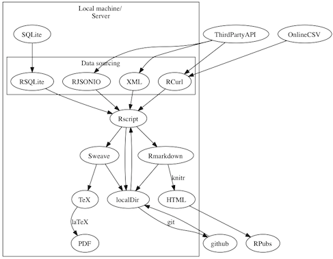

# 12. Data-driven advances

> Today's session is a bit special: we have guests. For our final session, we'll have a journalist, a political scientist and a member of the [Open Knowledge Foundation](http://okfn.org/) come and talk to us about what they do with data, how they do it, and why this concerns you. Below are a few introductory words.

DDJ

- [Guardian Data Blog](http://www.guardian.co.uk/data)
- Geoff McGhee, "[Journalism in the age of data](http://datajournalism.stanford.edu/)" (video)
- *New York Times*, "[The year in graphics](http://www.nytimes.com/interactive/2012/12/30/multimedia/2012-the-year-in-graphics.html?hp)"

## Better formats

XML, JSON, SDMX.

## Better access

APIs, World Bank open data.

CVS, Github.

## Better graphics

Google Motion Charts, [Gapminder](http://www.gapminder.org/), and [building your own web applications](http://blog.ouseful.info/2012/12/04/more-shiny-goodness-tinkering-with-the-ergast-motor-racing-data-api/) using [Shiny](http://www.rstudio.com/shiny/). Things are changing quickly in this area, which is under [active policy development](http://blog.ouseful.info/2012/12/12/this-week-in-open-and-communications-data-land/) in many (rich) countries.

See Tony Hirst's diagram of [reproducible research](http://blog.ouseful.info/2012/07/15/an-r-chitecture-for-reproducible-researchreportingdata-journalism/):

See the [*Crooked Timber* seminar](http://crookedtimber.org/2012/07/17/open-data-seminar-2/) for thoughts on open data, the [Sunlight Foundation](http://sunlightfoundation.com/) for an application by a U.S. non-profit group, [Open UNDP](https://blogstats.wordpress.com/2012/12/01/working-in-the-open/) for an official implementation, [Regards Citoyens](http://www.regardscitoyens.org/open-data-en-france/) for an implementation by a French non-profit group.

> Next: [].

