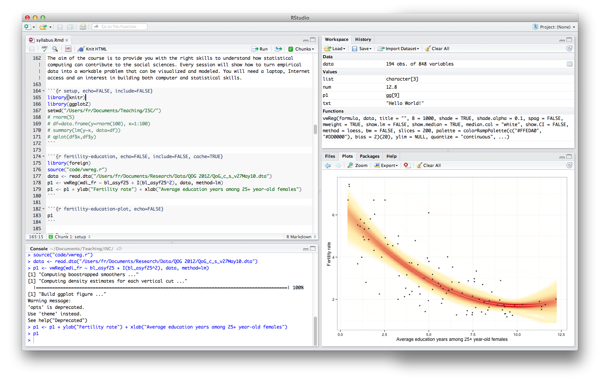

# 1.2. RStudio

Packages and other aspects of R are easier to handle in [RStudio](http://rstudio.org/), a programming environment for R that adds many useful features to R, including dynamic report generation with [Markdown](http://daringfireball.net/projects/markdown/), which we will cover later. A work session in RStudio that takes advantage of all these capabilities will look like this (click to zoom):
  

The top-left quadrant contains one file, `syllabus.Rmd`, which is the original version of this document. It contains code, comments and even text--all of which are weaved together by a package called [knitr](http://yihui.name/knitr/) that offers a way to go from coding to publishing HTML pages with syntax-coloured code chunks. RStudio helps by connecting that interface to [RPubs](http://www.rpubs.com/), which enables anyone to publish code and results in a few clicks.

The bottom-left quadrant is the console, where most results are printed out. The right-hand-side panels show the objects, files, plots and help pages in current use. There are many customizations and shortcuts in the software: for a brief overview, see Ricardo Pietrobon's [video introduction](http://www.youtube.com/watch?v=eL8qFKnTS6I). In class, we will start with a much simpler workflow and then upgrade it to dynamic report generation.

## Interface

The RStudio interface has several panels and functions that you will not need, but you *will* need the tab in the bottom-right quadrant called "Files" to access stuff for this course. The default place on your computer where R looks for stuff is called the **working directory**, and it can be set by default in RStudio's preferences. It is strongly recommended that you create a folder right now and set it as the working directory for the rest of the course.

### Setting the working directory

Use the `setwd()` command to set the working directory to a given folder path, or use the 'Tools > Set working directory > Choose...' menu item (shortcut: Cmmd-Shift-K on Mac OS X). You can also browse the 'Files' panel and use the 'Set as working directory' item in the 'More' menu.

### Viewing and running code

- open the demo code; switch between Console and code
- select a few lines
- run with Cmmd-Enter or 'run'

### Viewing data

- click the demo dataset
- manipulate quickly with a few commands (`head`, `str`)

### Exporting plots

- run the demo code
- view the plot in the 'Plots' panel
- export to PDF

### Exporting documents

- open the `syllabus.Rmd` file
- click 'Knit HTML' or Cmmd-Shift-H
- preview in your Web browser

## Updates

The first course email that circulated asked you to install RStudio 0.97.248, but there was a funny coincidence: RStudio was updated to version 0.97.306 on the day we started the class!

You might want to upgrade your version of RStudio to make sure that you keep the software on its latest version. On Mac OS X, there is a "Check for updates" item in the "Help" menu of RStudio.

## Troubleshooting

There's a few [known issues](http://support.rstudio.org/help/kb/troubleshooting/troubleshooting-guide-using-rstudio) with RStudio. When the problem concerns code execution, you should [start by running the code in R](http://support.rstudio.org/help/kb/troubleshooting/r-code-is-not-working) to see if the problem replicates. Other known issues can affect, for instance, [package installation](http://support.rstudio.org/help/kb/troubleshooting/problem-installing-packages), in which case the easiest workaround is usually to try another CRAN repository.

A deeper issue arises if you want to use the `View()` command in RStudio on Mac OS X. For the command to work, you will have to install [XQuartz](http://xquartz.macosforge.org/landing/) yourself, as it is not bundled anymore with the rest of the OS by default. Alternately, use `rstudio::viewData(whatever_dataset)` by double-clicking the data in your Workspace.

There might be more issues floating around, but our experience with RStudio has been mostly bug-free, so let's keep the picture rosy for now.
