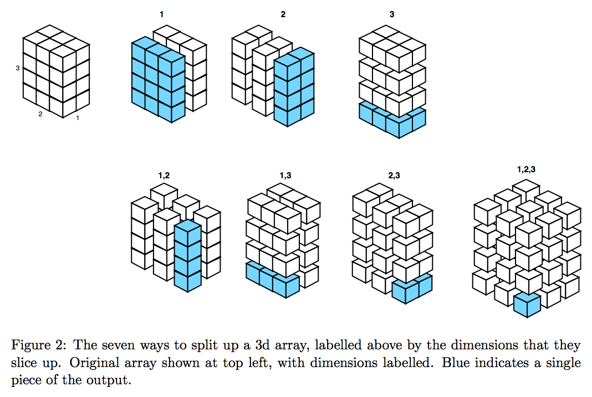
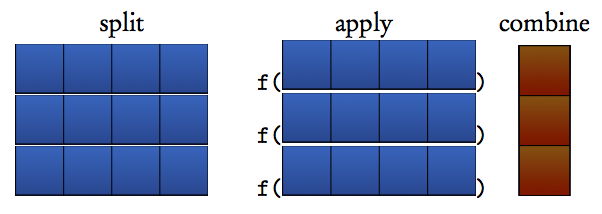

<style>@import url(style.css);</style>
<small>[Introduction to Data Analysis](index.html)</small>

# 4.2. Reshaping

Datasets do not always come in the exact form in which we want to analyze them: there is often some manipulation to do. Most people do this by hand, which is error-prone and time-consuming. This section covers a few ways to reshape a dataset.

Collapse, merge, [reshape](http://is-r.tumblr.com/post/34556058683/ggtutorial-day-1-using-reshape), etc. Illustrations with  of how , and help [identify patterns](http://is-r.tumblr.com/post/34288940225/congressional-ideology-by-state) in large datasets.

<!-- ## Calculations by groups

 https://gastonsanchez.wordpress.com/2012/06/28/5-ways-to-do-some-calculation-by-groups/ -->

## Using `plyr` to summarize aggregate data

More complex manipulations can produce [nice results](http://is-r.tumblr.com/post/33765462561/the-distribution-of-ideology-in-the-u-s-house-with) if you give some thought to the mathematics that you want to get into the plot.

We are going to look at ideology in the U.S. Congress by plotting the [DW-NOMINATE](http://voteview.org/dwnominate.asp) index, using an example byadapted from David Sparks.

```{r dwnominate1, results='hide', message=FALSE}
library(foreign)
library(Hmisc)

if (file.exists("data/dwnominate.dta")) {
  # Open local copy.
  dwNominate <- read.dta("data/dwnominate.dta")
} else {
  print("Cannot find dataset, loading from web...")
  # Retrieve file.
  dwNominate <- read.dta("ftp://voteview.com/junkord/HL01111E21_PRES.DTA")
  # Save local copy.
  write.dta(dwNominate, file = "data/dwnominate.dta")
}

# Make a re-coded party variable
dwNominate$majorParty <- "Other"
dwNominate$majorParty[dwNominate$party == 100] <- "Democrat"
dwNominate$majorParty[dwNominate$party == 200] <- "Republican"

# Have a look.
head(dwNominate)
```

The code now calls `plyr` to aggregate the observations by major party 

```{r dwnominate2, message=FALSE}
library(plyr)
# Letting plyr do the work for us (the weighted wtd.functions are from Hmisc)
aggregatedIdeology <- ddply(.data = dwNominate,
                            .variables = .(cong, majorParty),
                            .fun = summarise,
                            Median = wtd.quantile(dwnom1, 1/bootse1, 1/2),
                            q25 = wtd.quantile(dwnom1, 1/bootse1, 1/4),
                            q75 = wtd.quantile(dwnom1, 1/bootse1, 3/4),
                            q05 = wtd.quantile(dwnom1, 1/bootse1, 1/20),
                            q95 = wtd.quantile(dwnom1, 1/bootse1, 19/20),
                            N = length(dwnom1))

# Convert the major party variable to a factor variable.
aggregatedIdeology$majorParty <- factor(aggregatedIdeology$majorParty,
                                        levels = c("Republican", "Democrat", "Other"))

# All of our stats, calculated "by" our .variables.
head(aggregatedIdeology)
```

```{r dwnominate3}
# Neat, simple, clean plot of ideological distributions
zp1 <- ggplot(aggregatedIdeology,
              aes(x = cong, y = Median,
                  ymin = q05, ymax = q95,
                  colour = majorParty, alpha = N))
# Plot the 90% CI, inheritting x, y, colour and alpha
zp1 <- zp1 + geom_linerange(aes(ymin = q25, ymax = q75), size = 1)
zp1 <- zp1 + geom_pointrange(size = 1/2)  # Plot the IQR
zp1 <- zp1 + scale_colour_brewer(palette = "Set1")
zp1 <- zp1 + theme_bw()
print(zp1)
```

<!-- This example is about [Congressional ideology](http://research.bshor.com/2012/10/31/scoring-the-2012-congressional-candidates/). -->

## Using `melt` to collapse data

Here's an [example based on the recent housing bubble](http://www.decisionsciencenews.com/2011/03/17/the-housing-bubble-by-city/). It shows changes in the [Case Schiller Index](http://www.standardandpoors.com/indices/sp-case-shiller-home-price-indices/en/us/), a price index for the housing market, over the recent years.

The example is based on `ggplot2` and the `reshape` package.

```{r schiller1, results='hide'}
# Open the data.
dat <- read.csv("data/CSHomePrice_History.csv")
```

Let's have a look at the data.

```{r shiller2}
str(dat)
```

You can see that the data uses U.S. states as columns (inspect the `dat` table further with `head(dat)` if you fail to see it at first). Instead of that 'wide' format, we prefer to use 'long' data where all states are held in a single column.

To get there, let's `melt` the data. This will 'collapse' the dataset: all column variables will be put into a single one, except for those that we keep as identifier variables: these will be repeated over rows.

```{r schiller3, results='hide'}
# Load packages.
library(reshape)
# Collapse the data by years.
mdf <- melt(dat,id.vars="YEAR")
# Convert dates.
mdf$Date=as.Date(paste("01-",mdf$YEAR,sep=""),"%d-%b-%y")
# Name the columns.
names(mdf) <- c("MonthYear","City","IndexValue","Date")
```

Finally, here's the first plot, using a different color for each city. There's a lot of data but the general trend is clearly understandable.

```{r schiller4, warning=FALSE}
(fig.all <- ggplot(data=mdf, aes(x=Date, y=IndexValue)) +
geom_line(aes(color=City), size=1.25) +
scale_x_date("Year") + scale_y_continuous("Case Schiller Index"))
```

You will get a warning due to missing values. Let's go further and subset the data to a few urban or large states and plot the data again.

```{r schiller5, warning=FALSE}
# Keep only a handful of states.
sm=subset(mdf,City %in% c('NY.New.York','FL.Miami','CA.Los Angeles','MI.Detroit',
                          'TX.Dallas','IL.Chicago','DC.Washington'))
# Remove levels.
sm$City=droplevels(sm$City)
# Final plot.
(fig.subset <- ggplot(data=sm, aes(x=Date, y=IndexValue)) +
  geom_line(aes(color=City),size=1.5) +
  scale_x_date("Year") + scale_y_continuous("Case Schiller Index"))
```

Job's done.

## Atrociously brilliant reshaping stuff that we will spare you

Reshaping can become pretty complex once you go into its deeper mechanics.





Hadley Wickham's `plyr` package contains a command called `ddply` that is simply brilliant. It implements a technique called "[The Split-Apply-Combine Strategy for Data
Analysis](http://www.jstatsoft.org/v40/i01/paper)". Unfortunately, we won't have the time to go into the details of how it works, but we might end up using it occasionally.

> __Next__: [Scraping](43_scraping.html).
